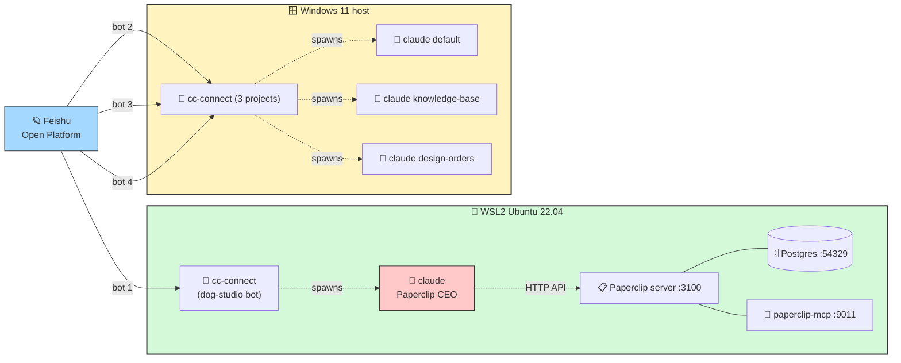
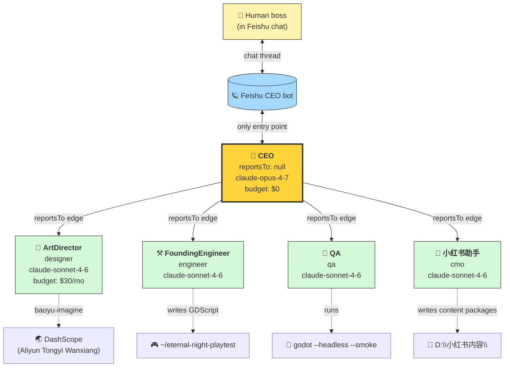

# Architecture

## The data flow, end to end

```mermaid
flowchart LR
    H["👤 Human<br/>in Feishu chat"] -->|"@mentions"| F["☁️ open.feishu.cn<br/>Feishu Open Platform"]
    F -->|"webhook / long poll"| C["🌉 cc-connect<br/>(WSL or Windows)"]
    C -->|"spawn one process per message"| W["🎭 claude-wrapper<br/>~/.local/bin/claude"]
    W -->|"exec with HTTPS_PROXY=Clash"| R["🤖 real claude binary<br/>--print --output-format=stream-json"]
    R -->|"HTTPS via Clash overseas node"| A["🟧 api.anthropic.com"]

    R -.->|"if agent is paperclip-aware"| P["📋 Paperclip HTTP API<br/>127.0.0.1:3100"]
    P --- DB[("🗄️ Postgres<br/>:54329")]
    P -.->|"wake events"| R

    style H fill:#fff3b0,stroke:#333
    style F fill:#a5d8ff,stroke:#333
    style C fill:#c0eb75,stroke:#333
    style W fill:#ffd8a8,stroke:#333
    style R fill:#ffc9c9,stroke:#333
    style A fill:#d0bfff,stroke:#333
    style P fill:#b5f5ec,stroke:#333
    style DB fill:#b5f5ec,stroke:#333
```



Key flow points:

- **One Feishu message = one fresh `claude` process.** State persists only via Paperclip's DB, `--resume <session-id>`, or files on disk in the agent's `work_dir`.
- **claude is wrapped**, not called directly. The wrapper re-adds `HTTPS_PROXY` for the LLM API call while keeping it unset for the parent (cc-connect → Feishu).
- **Paperclip is optional.** A "vanilla" cc-connect setup talks directly to claude with no Paperclip layer. The Paperclip arm is what turns a single bot into a multi-agent company.

## Why two execution sites (WSL + Windows)



| | WSL | Windows |
|---|---|---|
| Paperclip server + Postgres | ✅ runs here | ❌ |
| cc-connect for "main" bot tied to Paperclip CEO | ✅ | ❌ |
| cc-connect for standalone bots | ❌ | ✅ (×3) |
| Bot work directory lives on… | `/home/dog/work/…` | `D:\…` (Windows files) |

The two sides are **fully independent processes** — different configs, different Feishu apps, different work dirs. Either side can die without taking the other down.

## Paperclip agent topology



Key rules of the company:

- **Only the CEO talks to Feishu.** Subordinates have no Feishu app credentials. The CEO is the translator between the chat world and the Paperclip world.
- **CEO delegates, never ICs.** Its `AGENTS.md` instructions forbid writing code or doing IC work — it always opens a child issue and assigns to the right subordinate.
- **Subordinates wake via heartbeat.** When an issue is assigned/commented, Paperclip spawns the subordinate's claude adapter with `PAPERCLIP_AGENT_ID` + `PAPERCLIP_API_KEY` env vars. The subordinate reads its inbox, claims via `POST /api/issues/.../checkout`, does work, comments back, exits.
- **Results bubble up.** A subordinate's comment on a child issue triggers Paperclip to wake the parent (CEO) → CEO sees the result → CEO summarizes to the human via Feishu.

## Network plumbing (the painful part)

```mermaid
flowchart TB
    APP["📦 WSL app<br/>(cc-connect / curl / agent)"]

    subgraph DNS["DNS resolution"]
        FWD["10.255.255.254<br/>WSL → Windows forwarder"]
        CDNS["FlClash DNS<br/>fake-ip 28.0.0.0/8"]
        GW_DNS["LAN gateway DNS<br/>192.168.0.1"]
        FWD --> CDNS
        CDNS -.|"returns 28.0.0.x"|.-> APP
        GW_DNS -.|"returns real IP"|.-> APP
    end
    APP -->|"default DNS query"| FWD
    APP -.->|"explicit override (nslookup gw)"| GW_DNS

    APP -->|"TCP connect"| ROUTE{"kernel route table"}
    ROUTE -->|"default route"| TUN["🌐 FlClash TUN<br/>(eth1, 28.0.0.0/8)"]
    ROUTE -->|"static route to<br/>Feishu CIDRs<br/>via 192.168.0.1"| REAL["📡 real WLAN<br/>(eth0)"]

    TUN --> CR["⚙️ Clash rule engine"]
    CR -->|"MATCH (default)"| OS["🌍 Overseas proxy node<br/>(JP/SG/HK)"]
    CR -->|"GEOSITE,CN,DIRECT"| LOCAL["🇨🇳 direct CN exit"]

    REAL -->|"192.168.0.1"| LANGW["🏠 LAN gateway"]
    LANGW --> FEISHU["☁️ open.feishu.cn<br/>msg-frontier.feishu.cn"]
    OS --> EXT["🟧 api.anthropic.com<br/>youtube.com<br/>github.com"]
    LOCAL --> CN_NET["🇨🇳 CN-only services"]

    style APP fill:#fff3b0,stroke:#333
    style TUN fill:#ffc9c9,stroke:#333,stroke-width:2px
    style REAL fill:#d3f9d8,stroke:#333,stroke-width:2px
    style FEISHU fill:#a5d8ff,stroke:#333
    style EXT fill:#d0bfff,stroke:#333
    style OS fill:#fcc2d7,stroke:#333
```

**Two failure modes solved here:**

1. **Feishu API calls** routed overseas → Feishu sees a foreign IP for a domestic-only endpoint → EOF / ERR_CONNECTION_CLOSED.
   - **Fix:** static routes (`feishu-routes.sh` / `add-feishu-routes.ps1`) override the default route for Feishu CIDRs, sending them through the real adapter instead of TUN.
   - **Belt:** `/etc/hosts` + Windows hosts file pin the hostnames to known IPs, so even if Clash's DNS layer intercepts, the resolved IP routes correctly via static rules.

2. **Anthropic API** from a Chinese IP → 403.
   - **Fix:** `claude-wrapper` re-injects `HTTPS_PROXY=Clash` only for the `claude` subprocess. The wrapper's parent (cc-connect) keeps proxy unset (so Feishu still works).

See [pitfalls.md](pitfalls.md) for the war stories — 11 traps with exact error messages and fixes.
